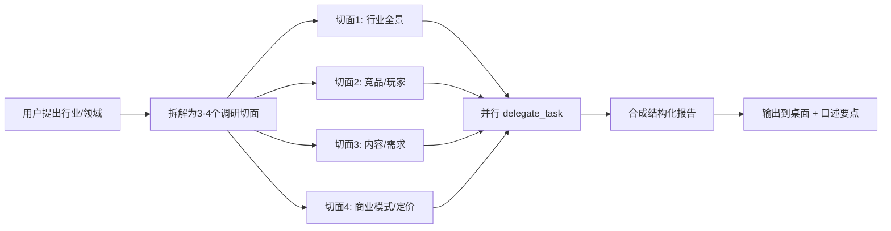

# Business Domain Research

## When to Use

用户说要"深入了解 XX 行业"、"调研 XX 市场"、"看看 XX 有没有机会"、"做一个全面的行业研究"时触发。这个技能通过并行子代理同时从多个关键角度切入，比串行调研效率高 3 倍。

## Core Approach



## 标准调研切面

根据用户需求从以下切面中选择 3-4 个（不要超过 4 个，受 `max_concurrent_children` 限制）：

| 切面 | 内容 | 适合场景 |
|------|------|---------|
| **行业全景** | 市场规模、增长率、地域格局、产业链位置 | 任何行业调研 |
| **竞品分析** | 现有玩家、产品/服务、定价、融资、差异化机会 | 产品定位、创业 |
| **内容赛道** | 中文互联网相关内容供给量、竞品账号、流量话题、蓝海方向 | 想做行业内容 |
| **市场需求** | 客户痛点、付费意愿、定价参考、获客渠道 | 2B/2C 服务、产品 |
| **技术趋势** | 关键技术、发展趋势、替代风险 | 技术型产品、内容 |
| **政策/合规** | 监管、牌照、合规风险 | 金融/医疗/教育等强监管行业 |
| **人才供需** | 人才缺口、薪资水平、技能需求 | 个人职业规划、培训 |

## Workflow

### Step 0: 确认用户对市场的了解（CRITICAL — 调研前必做）

**在启动任何并行调研之前**，必须先向用户确认核心市场假设。用户是行业从业者，一句纠正可能省掉三份方向错误的报告。

用 1-2 个 clarify 问题确认：

- "你对这个市场的现状了解多少？有没有已知的'原厂已在做'或'竞品已覆盖'的情况？"
- "你觉得客户愿意为什么付钱？有没有你已经观察到的真实付费场景？"

**危险信号（立刻暂停调研，重新定义问题）：**
- 用户说"这个东西我们公司/行业已经在做了"
- 用户说"这个客户不需要，原厂免费提供"
- 用户说"我不确定，我离客户比较远"

如果用户对市场不熟悉 → 先做最小的市场验证（一条闲鱼帖、一篇小红书），而不是全面调研。

**本 session 的教训**：Jerry 提到"SECS/GEM 我们公司有专门部门在做，远程控制已经成熟"之后，之前假设的"SECS/GEM 是市场空白"完全不成立，三份调研报告的方向必须重新校准。

### Step 1: 理解用户场景

用 clarify 快速确认用户的核心目标（1-2 个问题）：

- "你想了解这个行业是为了什么？—— A.做产品卖给他们 B.做内容吸引他们 C.找工作/转行"
- "你最关心哪 2-3 个方面？"

如果用户已经说了"全方位了解"，直接跳到 Step 2，选 4 个标准切面。

### Step 2: 拆解调研切面（关键）

从标准切面表中选择 3-4 个，为每个切面写一个清晰的 `delegate_task` 任务说明：

```python
# 每个任务的 context 必须包含：
context = f"""
用户背景：{user_info（行业、职位、技能、所在城市）}
目标：{user_goal（做什么业务/产品/内容）}
需要真实、具体的数据，不要模糊概括。用中文回答。
"""

# 每个任务的 goal 必须明确：
goal = f"调研{aspect}：{具体问题清单}。整理成结构化的中文报告，列出关键数据。"
```

**关键原则**：
- context 里放用户背景信息（让子代理理解上下文）
- goal 里放具体问题（聚焦不要发散）
- 每个任务设置 `toolsets=["web"]` 以便联网搜索

### Step 3: 提交并行任务

```python
tasks = [{"goal": g1, "context": ctx, "toolsets": ["web"]}, ...]
results = delegate_task(tasks=tasks)  # 最多 3 个并行
```

如果超过 3 个切面，分批执行（第一批 3 个，第二批剩余）。

### Step 4: 合成报告

将各子代理的结果融合为一份结构化报告，包含：
1. **浓缩版结论**（3-5 句话，让用户一眼看完）
2. **各维度详细数据**（表格、排名、定价）
3. **综合分析**（所有切面的交叉点——比如"行业痛点 X + 内容稀缺 Y + 竞品缺失 Z = 你的机会"）
4. **行动建议**（基于调研结果的下一步做什么）

### Step 5: 输出

1. 把完整报告写到桌面项目目录：`Desktop/{project-name}/{report-name}.md`
2. 在对话中给用户口述**核心结论**（3-5 句话，不要照念）
3. 让用户知道完整报告在哪，方便以后查阅

## 输出模板

```markdown
# {行业名} 调研报告

> 调研范围：{切面列表}
> 调研时间：{日期}

---

## 一句话结论

{核心洞察}

## 关键数据

| 指标 | 数据 | 来源 |
|------|------|------|
| ... | ... | ... |

## 各维度详情

### 1. {切面1标题}
{结构化的数据、排名、表格}

### 2. {切面2标题}
...

## 综合分析

{所有切面的交叉点 → 机会洞察}

## 行动建议

1. ...
2. ...
3. ...
```

## 已知行业知识库（可作为子代理的 context 补充）

当调研半导体行业时，以下背景可预填给子代理（避免它们从头搜索基础数据）：

```
中国封测市场 ~3100亿元，占全球 ~45%
TOP3 OSAT：长电(江阴)、通富(南通)、华天(天水/西安/昆山)
苏州是封测产业最密集城市之一（日月新、嘉盛、晶方、京隆）
设备商：K&S (焊线机) / ASM Pacific (固晶+焊线) / Disco (划片) / TOWA (塑封)
行业痛点：设备数据孤岛、经验断层、故障诊断效率低、数字化程度低
```

（类似的知识银行可以随每次调研积累到 `references/` 目录下）

## 调研案例参考

详见 `references/semiconductor-osat-research-2026-06.md` — 一份完整的 4 维度并行调研输出（封测行业全景 → AI Agent 竞品 → 内容赛道 → 自动化服务定价），展示了并行 `delegate_task` 的报告格式、竞品定价分析和行动建议模板。

## 保存关键数据到 Memory

调研报告可能很长。在合成报告后，将关键的量化数据（市场规模、头部玩家、定价区间、竞品名称）保存到 `memory()`：

```python
memory(action="add", target="memory",
    content="半导体封测行业 2026-06: 中国 ~3100亿, TOP3 长电/通富/华天, 设备数据孤岛痛点, AI Agent 竞品 第四范式/雪浪云/思谋科技")
```

这样后续会话可以直接引用，无需重新调研。只保存高度压缩的关键事实——完整报告在磁盘文件中。

## 相关工具

- **PM 产品评估框架** → `references/pm-evaluation-framework.md` — 当调研结束后有多条产品线需要比较优先级时使用。五维打分（痛点/市场/可行/护城河/变现速度），交叉分析后做资源分配决策。

## Pitfalls

1. **子代理无记忆** — 每个 delegate_task 是独立会话，必须把用户背景写进 context，不能指望子代理知道之前的对话
2. **子代理可能胡编数据** — 要求返回具体数字时要标注"估"/"据 XX 来源"，或者要求返回可验证来源
3. **max_concurrent_children = 3** — 默认最多 3 个并行，超出的分批
4. **子代理默认英文** — 即使本技能是中文版，子代理仍默认英文输出。每次提交任务时必须在 context 或 goal 中显式声明"用中文回答"
5. **不要过度调研** — 3-4 个切面足够，超过 4 个会信息过载。先出报告，用户需要再加细节
6. **工具不可用时回退** — 如果 `web` 工具集不可用，基于已有知识输出并注明"数据截至 XX 日期，未实时更新"
7. **启动调研前必须验证市场假设** — 子代理会无条件接受 context 中的前置假设（例："SECS/GEM 是市场空白"），如果这个假设是错的，所有调研报告都会产生系统性偏差。在提交 delegate_task 之前，先用 clarify 向用户确认 1-2 个核心市场假设是否成立。用户是行业从业者，他们的一句话纠正可能省掉三份方向错误的报告。典型信号：用户说"这东西我们公司已经在做了"→ 立刻暂停调研，重新定义问题
8. **子代理报告是自报告，非验证事实** — 关键数字（定价、市值、员工数）需要自行交叉验证或向用户标注不确定性
