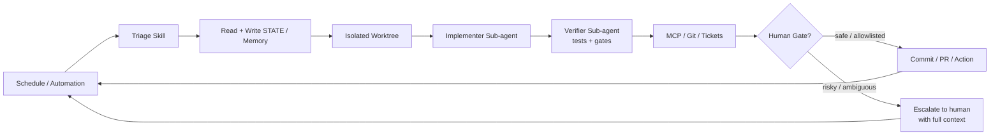

# Loop Engineering

## 核心定义

> **Loop engineering = 你不再手动给 AI 发指令，而是设计一套系统让 AI 自己跑。**

## 为什么重要

> **Peter Steinberger**："你不应该再手动 prompt 编程 agent 了。你应该设计 loop 来 prompt 你的 agent。"
>
> **Boris Cherny（Anthropic Claude Code 负责人）**："我已经不再手动 prompt Claude 了。我有 loop 在运行，它们自己决定该 prompt Claude 做什么。我的工作就是写这些 loop。"

杠杆点从"写好一条 prompt"变成了"设计一套控制系统"。

---

## 六大基础构件

| 构件 | 在 Loop 里的作用 | Hermes 对应 |
|------|-----------------|-------------|
| **Automations / 调度** | 定时发现 + 筛选任务 | cronjob |
| **Worktrees** | 安全的并行执行环境 | 缺 |
| **Skills** | 持久化的项目知识 | skill |
| **Plugins / Connectors** | 接入真实工具 | MCP |
| **Sub-agents** | 写代码/验证分离 | delegate_task |
| **+ Memory / 状态** | 跨会话持久上下文 | memory + SOUL |

## Loop 典型流程

---

## 7 个生产级 Pattern

| 模式 | 节奏 | 做什么 |
|------|------|--------|
| **Daily Triage** | 每天/2小时 | 每天自动扫一遍项目，出一份报告 |
| **PR Babysitter** | 5-15分钟 | 监控 PR 的变化，自动检查 |
| **CI Sweeper** | 5-15分钟 | 修复 CI 失败的构建 |
| **Dependency Sweeper** | 6小时~1天 | 扫依赖更新，只打安全补丁 |
| **Changelog Drafter** | 打标签时 | 自动生成更新日志 |
| **Post-Merge Cleanup** | 每天 | 合并后清理遗留问题 |
| **Issue Triage** | 2小时~1天 | 分类 GitHub Issue |

## 安全三段式

- **L1 — Report only**：只看不修，出报告
- **L2 — Assisted fixes**：辅助修复，需要确认
- **L3 — Unattended**：全自动，无人值守

---

## 相关链接

- 官方 showcase: https://cobusgreyling.github.io/loop-engineering/
- Substack 文章: https://cobusgreyling.substack.com/p/loop-engineering
- Addy Osmani 文章: https://addyosmani.com/blog/loop-engineering/

## 对 Jerry 项目的关联

与 Hermes 的对应关系几乎完整（唯独缺 Worktrees）。Jerry 现在正在构建的"一人公司 + AI profile 员工"架构本质上就是一个 Loop Engineering 实例——Tom1 作为 orchestrator 调度 Justin（coder）和 Eli（RAG engineer）就是 Loop 的实践。
